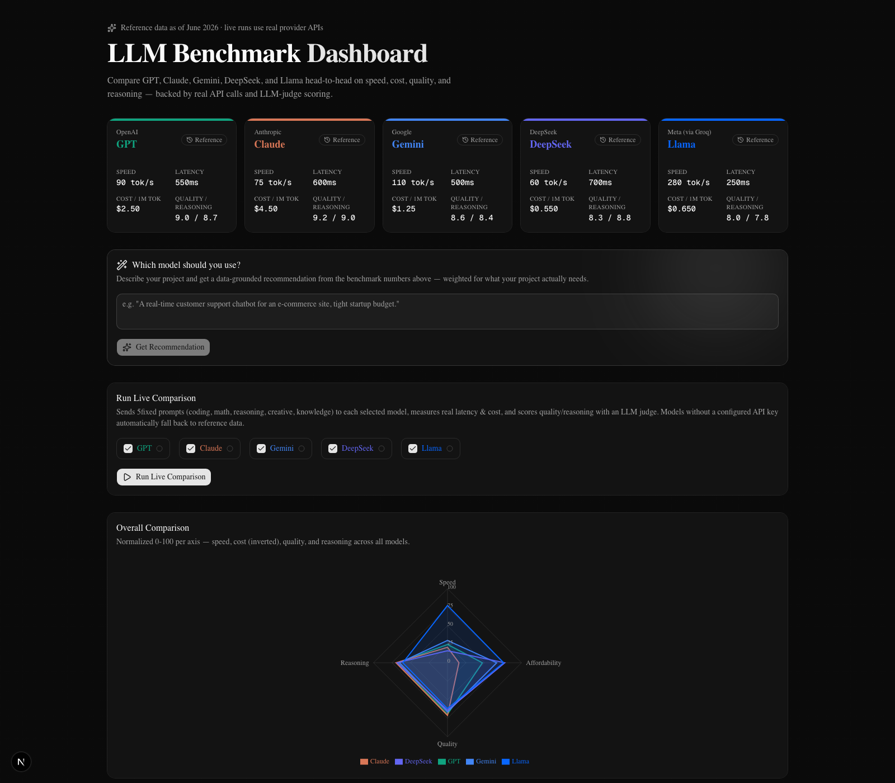

<div align="center">

# LLM Benchmark Dashboard

**Compare GPT, Claude, Gemini, DeepSeek, and Llama on speed, cost, quality, and reasoning — then get a data-grounded recommendation for which one fits *your* project.**

[](https://nextjs.org)
[](https://www.typescriptlang.org)
[](https://tailwindcss.com)
[](LICENSE)



</div>

## What this is

A dashboard for comparing frontier LLM APIs that's actually useful, not just a static leaderboard:

- 📊 **Always populated** — loads instantly with curated reference numbers for all 5 models, no setup required
- ⚡ **Real live runs** — a "Run Live Comparison" button optionally fires real requests at each provider's API, measures true latency and token cost, and scores every response with an LLM judge
- 🧭 **Model recommendation engine** — describe your project in plain English and get a ranked recommendation, weighted by what *that* project actually needs and grounded in the benchmark numbers on screen
- 🛡️ **Never breaks** — any model missing an API key gracefully falls back to reference data instead of erroring out, so the dashboard always looks complete (great for demos)

## Features

| | |
|---|---|
| **Radar comparison** | Normalized 0–100 view of speed, cost, quality, and reasoning across all 5 models at once |
| **Cost & speed charts** | Blended $/1M token pricing and tokens/sec throughput, bar-charted per model |
| **Sortable leaderboard** | Click any column to re-rank models by that metric |
| **Live comparison run** | 5-prompt fixed eval suite (coding, math, reasoning, creative writing, knowledge Q&A) run identically against every model |
| **LLM-judge scoring** | Claude grades every live response 1–10 on quality and reasoning with a written rationale |
| **Response viewer** | Read each model's actual output side-by-side, not just the score |
| **"Which model should I use?"** | Type a project description → an LLM (or a keyword-based fallback with zero API keys) infers what matters most for it, then ranks all 5 models by a weighted, data-backed score |

## Quick start

Runs entirely on your machine — no Vercel account, no cloud setup, no deployment required:

```bash
git clone <this-repo>
cd llm-benchmark-dashboard
npm install
npm run dev
```

Open [http://localhost:3000](http://localhost:3000). Everything works immediately — reference data, charts, leaderboard, and the recommendation engine (using its keyword-based fallback) all run with **zero configuration**.

## Enabling live API calls

Copy the env template and add whichever keys you have — you don't need all five, and the app degrades gracefully around whatever's missing:

```bash
cp .env.local.example .env.local
```

| Variable | Powers | Get a key |
|---|---|---|
| `OPENAI_API_KEY` | GPT | [platform.openai.com/api-keys](https://platform.openai.com/api-keys) |
| `ANTHROPIC_API_KEY` | Claude, **plus** the LLM judge and the recommendation engine — worth setting even if you skip Claude itself | [console.anthropic.com/settings/keys](https://console.anthropic.com/settings/keys) |
| `GOOGLE_API_KEY` | Gemini | [aistudio.google.com/app/apikey](https://aistudio.google.com/app/apikey) |
| `DEEPSEEK_API_KEY` | DeepSeek | [platform.deepseek.com/api_keys](https://platform.deepseek.com/api_keys) |
| `GROQ_API_KEY` | Llama (served via Groq) | [console.groq.com/keys](https://console.groq.com/keys) |

Restart `npm run dev` after editing `.env.local`, then hit **Run Live Comparison**. Any model without a key (or whose judge call fails) automatically falls back to reference numbers, marked with a "Reference" badge instead of "Live" — the dashboard never breaks, it just tells you what's live and what isn't.

## Running it locally in production mode

`npm run dev` is fine for normal use, but if you want the exact build that would run in production (faster, no dev overlay, no hot-reload flicker — useful for demos or recordings), build it once and start it instead:

```bash
npm run build
npm run start
```

This still serves on [http://localhost:3000](http://localhost:3000) and reads the same `.env.local` — it's just the production bundle instead of the dev server. No Vercel or any external service involved either way; both commands run 100% locally.

## How the recommendation engine works

1. You describe your project in the text box (e.g. *"a real-time customer support chatbot, tight startup budget"*).
2. If `ANTHROPIC_API_KEY` is set, Claude reads the description and assigns importance weights (0–1) to speed, cost, quality, and reasoning for that specific project — e.g. a latency-sensitive chatbot weights speed and cost highly, a compliance-heavy analysis tool weights quality and reasoning highly.
3. Without a key, a keyword-based heuristic (`lib/recommend.ts`) infers the same weights from the description, so the feature still works with zero setup.
4. Those weights are combined with the **actual benchmark numbers currently on screen** (live results if you've run a comparison, reference data otherwise) into a weighted composite score per model.
5. The top model is recommended with a rationale that cites real numbers — throughput, cost, quality/reasoning scores — not just a name.

## Project structure

```
app/
  page.tsx                       dashboard page
  api/run-comparison/route.ts    live per-model benchmark run
  api/recommend/route.ts         project → weighted model recommendation
components/dashboard/            all dashboard UI (cards, charts, table, run panel, recommendation panel, response viewer)
lib/
  providers/                     provider adapters — OpenAI-compatible (OpenAI/DeepSeek/Groq), Anthropic, Gemini
  judge.ts                       LLM-judge quality/reasoning scoring
  recommend.ts                   heuristic weighting + weighted model scoring
  pricing.ts                     $/1M token cost calculation
data/
  seed-benchmarks.ts             reference data + model metadata (colors, vendor, etc.)
  eval-suite.ts                  fixed prompts used for live runs
```

DeepSeek and Llama (via Groq) are OpenAI-compatible APIs, so they reuse the `openai` SDK pointed at a different `baseURL` (`lib/providers/openaiCompatible.ts`) instead of duplicating client code.

## Deploying (optional)

You don't need to deploy anything — the sections above run the full app locally. Deploy only if you want a public URL to share.

[](https://vercel.com/new)

Push this repo to GitHub and import it on [Vercel](https://vercel.com/new). Add the same environment variables from `.env.local.example` in the project's settings to enable live comparisons in production — the dashboard works fine with none of them set too.

Not using Vercel? Any host that runs a Node.js server works the same way: `npm run build` then `npm run start`, with the env vars from `.env.local.example` set however that platform expects (e.g. Railway, Render, Fly.io, or your own server).

## License

[MIT](LICENSE)
